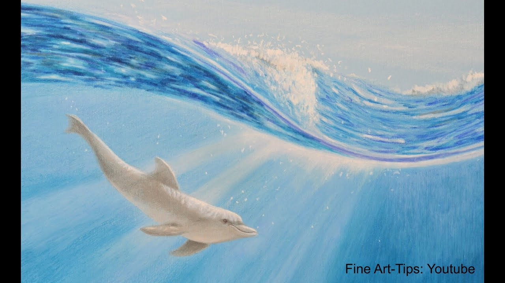

# SwiftRenderer

3D Rendering in Swift. Practice Swift, practice 3D rendering.

Created this project because value type in Swift is a great fit to math primitives and operations in 3D rendering, with efficient memory allocation for new and copied values.

## Light Beam

Image credit: How to Draw a Dolphin Underwater With Color Pencils - Wie malt man einen Delfin unter Wasser. https://www.youtube.com/watch?v=HETpyfd3104

Photon: emitted by light source -> a) travel towards a random direction -> b) interact with participating media -> c) interact with obstacle -> d) absorbed by the obstacle, or travel towards another direction after the interaction with the obstacle -> repeat a) to d) until absorbed in d)

- Perlin Noise for light beam pattern and intensities for obstacles like water and forest
- Light source specification
- Obstacle approximation: what're the light directions and intensities after being obscured?
- Perceive the scene from arbitrary viewpoint

## Next

- Draft light beam architecture with configuration separated from light beam rendering
